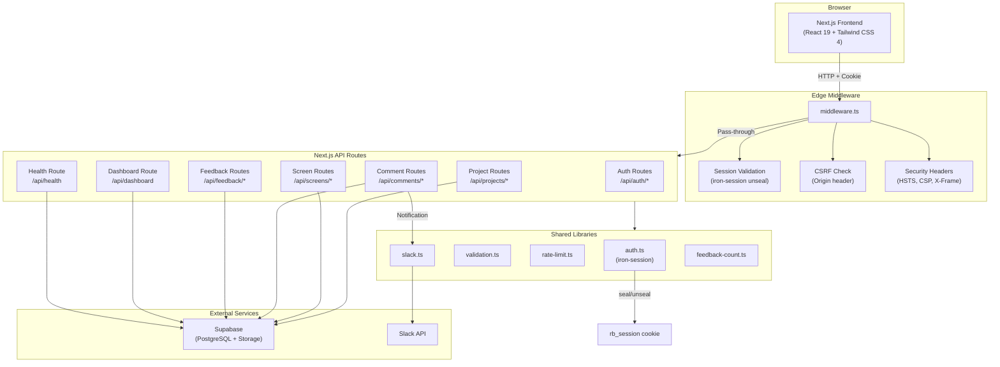
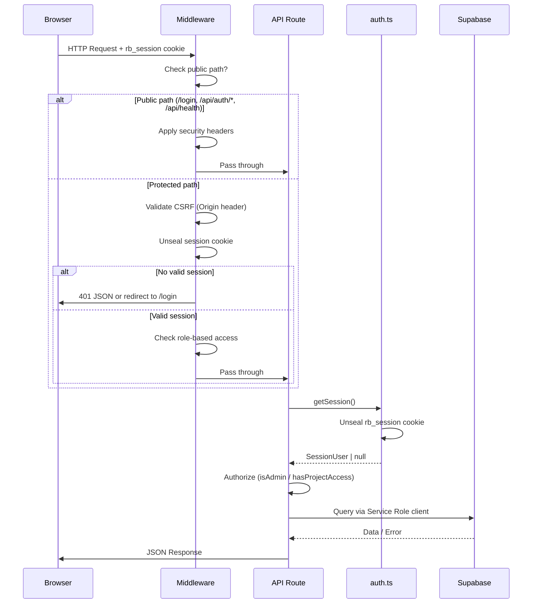
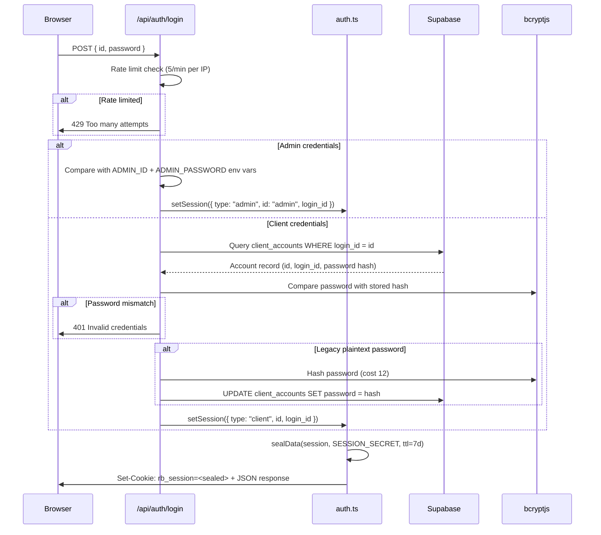
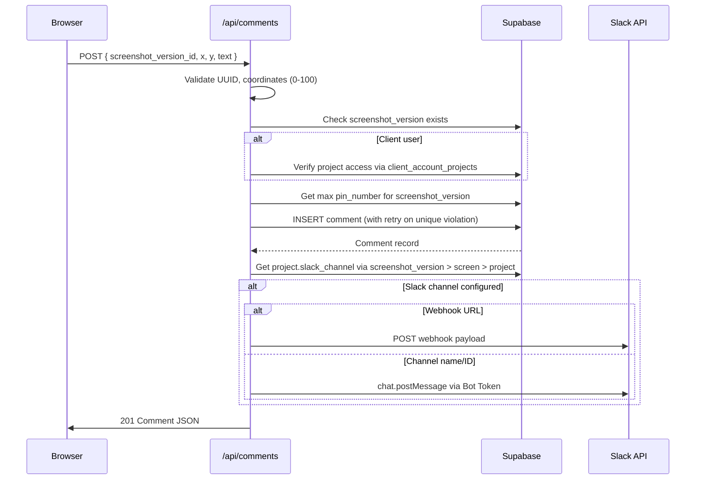
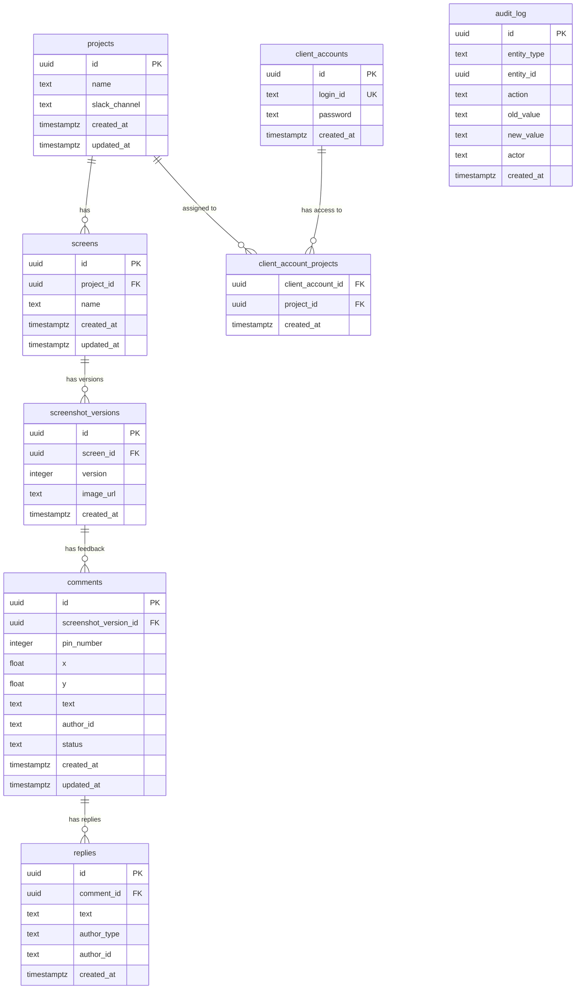
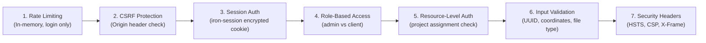

# ReviewBoard Architecture

## Overview

ReviewBoard is a design feedback platform that allows admin users to manage projects and screens, while clients can view their assigned projects and leave pin-based feedback comments on screenshot versions. Built with Next.js 16 (App Router), Supabase (PostgreSQL + Storage), and iron-session for authentication.

---

## Project Structure

```
app/
  src/
    app/
      api/
        auth/
          login/route.ts        # POST - authenticate admin/client
          logout/route.ts       # POST - destroy session
          me/route.ts           # GET  - session check
        projects/
          route.ts              # GET (list) / POST (create)
          [id]/
            route.ts            # GET / PATCH / DELETE single project
            screens/
              route.ts          # POST - create screen
              [screenId]/
                screenshots/
                  route.ts      # POST - upload screenshot (multipart)
          bulk/
            route.ts            # DELETE - batch delete projects
        feedback/
          route.ts              # GET  - list all feedback (admin)
          [id]/route.ts         # GET  - single feedback detail
          bulk/route.ts         # PATCH - bulk status update
        comments/
          route.ts              # POST - create pin comment
          [id]/
            route.ts            # PATCH / DELETE single comment
            replies/
              route.ts          # POST - add reply
        screens/
          [id]/route.ts         # GET / DELETE single screen
        dashboard/
          route.ts              # GET  - aggregate stats
        health/
          route.ts              # GET  - health check
    lib/
      auth.ts                   # iron-session helpers (get/set/clear session)
      types.ts                  # TypeScript interfaces
      validation.ts             # UUID & coordinate validators
      rate-limit.ts             # In-memory rate limiter
      slack.ts                  # Slack notification (Bot Token + Webhook)
      feedback-count.ts         # Open feedback count aggregators
      env.ts                    # Environment variable validation
      supabase/
        server.ts               # Server-side Supabase clients (SSR + Service Role)
        client.ts               # Browser-side Supabase client
    middleware.ts               # Auth guard, CSRF check, security headers
  supabase/
    migrations/                 # Ordered SQL migration files
    seed.sql                    # Development seed data
```

---

## System Architecture Diagram



---

## Data Flow

### Request Lifecycle



### Authentication Flow



### Comment Creation Flow (with Slack)



---

## Database Schema



### Key Relationships

- **projects <-> client_accounts**: Many-to-many via `client_account_projects` junction table.
- **projects -> screens**: One-to-many. Cascade delete.
- **screens -> screenshot_versions**: One-to-many. Unique constraint on `(screen_id, version)`. Cascade delete.
- **screenshot_versions -> comments**: One-to-many. Unique constraint on `(screenshot_version_id, pin_number)`. Cascade delete.
- **comments -> replies**: One-to-many. Cascade delete.
- **audit_log**: Independent table tracking status changes, edits, and deletes for comments.

### Constraints

| Table | Constraint | Description |
|-------|-----------|-------------|
| `projects.name` | `char_length(name) <= 255` | Max name length |
| `screens.name` | `char_length(name) <= 255` | Max name length |
| `comments.x` | `x >= 0 AND x <= 100` | Percentage coordinate |
| `comments.y` | `y >= 0 AND y <= 100` | Percentage coordinate |
| `comments.text` | `char_length(text) <= 5000` | Max comment length |
| `comments.status` | `IN ('open', 'in-progress', 'resolved')` | Valid statuses |
| `replies.text` | `char_length(text) <= 5000` | Max reply length |
| `replies.author_type` | `IN ('admin', 'client')` | Valid author types |
| `audit_log.entity_type` | `IN ('comment', 'project', 'screen', ...)` | Valid entity types |

---

## Security Architecture

### Defense Layers



### Security Headers

Applied by both middleware and `next.config.ts`:

| Header | Value | Purpose |
|--------|-------|---------|
| `Strict-Transport-Security` | `max-age=31536000; includeSubDomains` | Force HTTPS |
| `Content-Security-Policy` | Restrictive policy | Mitigate XSS |
| `X-Frame-Options` | `DENY` | Prevent clickjacking |
| `X-Content-Type-Options` | `nosniff` | Prevent MIME sniffing |
| `X-DNS-Prefetch-Control` | `off` | Prevent DNS prefetch leaks |
| `Referrer-Policy` | `strict-origin-when-cross-origin` | Limit referrer exposure |
| `Permissions-Policy` | `camera=(), microphone=(), geolocation=()` | Disable device APIs |

### File Upload Security

Screenshot uploads are validated server-side by reading magic bytes:
- **PNG**: `89 50 4E 47`
- **JPEG**: `FF D8 FF`
- **WebP**: `52 49 46 46`
- **GIF**: `47 49 46`

Maximum file size: **10 MB**.

---

## Supabase Integration

### Client Types

| Client | Usage | RLS |
|--------|-------|-----|
| `createServerSupabase()` | SSR with user cookies (not currently used by API routes) | Respects RLS |
| `createServiceSupabase()` | All API routes (service role key) | **Bypasses RLS** |
| `createClient()` | Browser-side (anon key) | Respects RLS |

### Storage

Screenshots are stored in a Supabase Storage bucket named `screenshots`.

Path format: `{screen_id}/v{version}.{extension}`

---

## Slack Integration

Comments trigger Slack notifications when the project has `slack_channel` configured.

Two modes are supported:

1. **Webhook URL**: If `slack_channel` starts with `https://hooks.slack.com/`, the system sends directly to the webhook.
2. **Bot Token**: Otherwise, `slack_channel` is treated as a channel name/ID and `SLACK_BOT_TOKEN` env var is used with `chat.postMessage`.

---

## Environment Variables

| Variable | Required | Description |
|----------|----------|-------------|
| `NEXT_PUBLIC_SUPABASE_URL` | Yes | Supabase project URL |
| `NEXT_PUBLIC_SUPABASE_ANON_KEY` | Yes | Supabase anonymous key (client-safe) |
| `SUPABASE_SERVICE_ROLE_KEY` | Yes | Supabase service role key (server-only) |
| `SESSION_SECRET` | Yes | iron-session encryption key (min 32 chars) |
| `ADMIN_ID` | Yes | Admin login ID |
| `ADMIN_PASSWORD` | Yes | Admin login password |
| `SLACK_BOT_TOKEN` | No | Slack Bot User OAuth Token |
